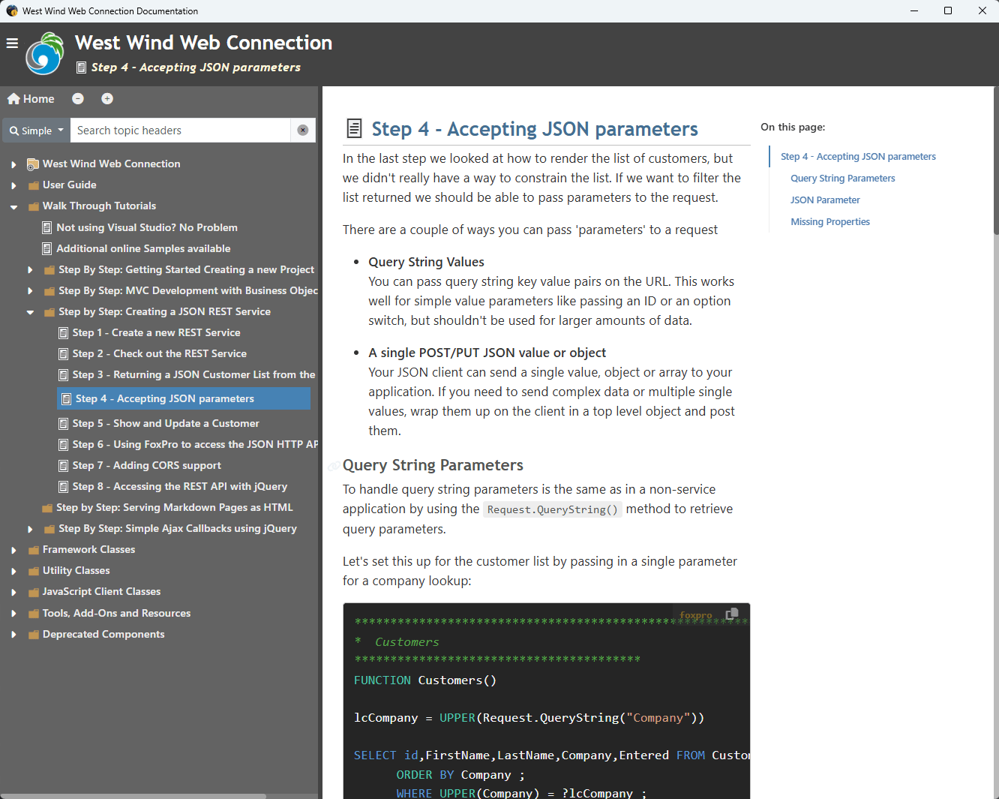

A number of people have asked for offline documentation for the Web Connection documentation and we're making it available as a separate download from here:

* [Web Connection Documentation Offline Viewer](https://webconnection.west-wind.com/docs/WebConnectionDocumentationViewer.exe)

This tool is a separate single EXE file application that runs the documentation as a local Documentation Viewer:

### Not updated frequently as Online Documentation
Please note that we don't update the offline viewer as frequently, so it's always going to be slightly out of date. The online docs are updated as soon as changes are made, while the viewer is posted for interim releases.